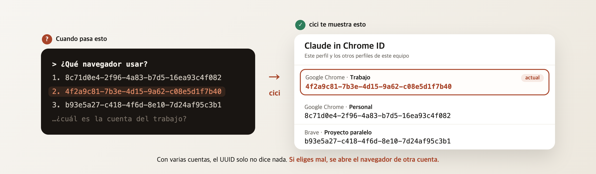
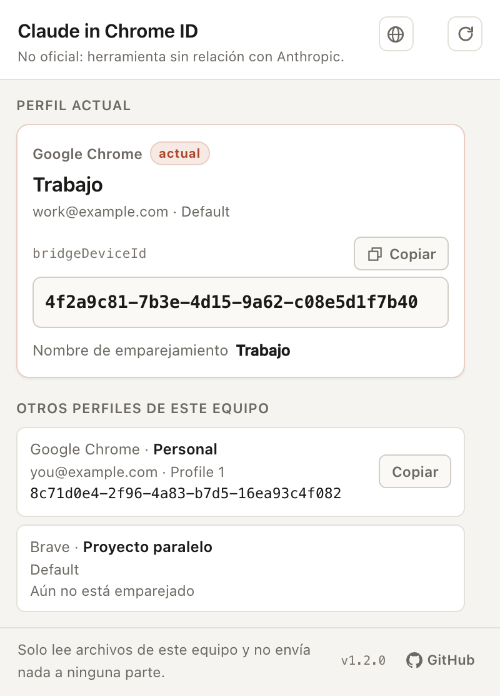

<div align="center">


# cici

**Te dice a qué perfil de Chrome pertenece cada UUID del selector de navegador de Claude Code**

<sub>🇰🇷 <a href="README.ko.md">한국어</a> · 🇺🇸 <a href="README.md">English</a> · 🇨🇳 <a href="README.zh-CN.md">简体中文</a> · 🇧🇷 <a href="README.pt.md">Português</a> · 🇯🇵 <a href="README.ja.md">日本語</a> · 🇪🇸 <b>Español</b> · 🇩🇪 <a href="README.de.md">Deutsch</a> · 🇫🇷 <a href="README.fr.md">Français</a></sub>

[](https://chromewebstore.google.com/detail/gfffgnkeglhkdnkoindcikdblebcmgea)
[](LICENSE)
[](package.json)
[](test)



<sub>Herramienta no oficial. No fue creada por Anthropic y no tiene ninguna relación con Anthropic.<br>
Claude, Claude Code y Claude in Chrome son marcas comerciales de Anthropic.</sub>


</div>

---

## El problema

Si usas más de un perfil de Chrome — trabajo, personal, un proyecto paralelo — Claude Code
te pregunta qué navegador usar y **no te da más pista que un UUID.**

```
¿Qué navegador?
  1. 8c71d0e4-2f96-4a83-b7d5-16ea93c4f082
  2. 4f2a9c81-7b3e-4d15-9a62-c08e5d1f7b40
  3. b93e5a27-c418-4f6d-8e10-7d24af95c3b1
```

Elige el equivocado y **se abre un navegador con la sesión de otra cuenta.** Querías trabajar
con la cuenta de la empresa y aparece tu navegador personal — o al revés.

cici responde exactamente a esa única pregunta: **qué UUID pertenece a qué perfil.**

<div align="center">

</div>

### Apréndelo una vez y deja de elegir

```
Abre el navegador del trabajo (4f2a9c81-7b3e-4d15-9a62-c08e5d1f7b40)
```

También puedes dejarlo fijo con `/chrome` → **Select browser…**. En ambos casos necesitas
conocer el UUID.

---

## Instalación

### 1. [Instálala desde Chrome Web Store](https://chromewebstore.google.com/detail/gfffgnkeglhkdnkoindcikdblebcmgea)

No hace falta clonar el repositorio ni compilar nada. Una vez instalada desde la tienda, Chrome
se encarga de mantenerla actualizada.

La ventana emergente está disponible en **ocho idiomas**: español, inglés, coreano, chino
simplificado, portugués, japonés, alemán y francés. De forma predeterminada sigue el idioma de
la interfaz de Chrome (cualquier otro idioma recurre al inglés), y con el icono de globo de la
parte superior derecha puedes cambiarlo directamente.

### 2. Activa el acceso a las URL del archivo

Este paso es **obligatorio**. Sin él, la ventana emergente muestra instrucciones en lugar de
resultados.

1. Abre `chrome://extensions`
2. cici → **Detalles**
3. Activa **Permitir el acceso a las URL del archivo**
4. Haz clic en el icono de la barra de herramientas

> Al activar ese interruptor, Chrome vuelve a cargar la extensión y la ventana emergente se
> cierra. No es un fallo. No hace falta reiniciar el navegador: **basta con volver a abrirla.**

**Por qué se necesita este permiso.** El `bridgeDeviceId` es un valor que la extensión Claude in
Chrome guarda en su propio `chrome.storage.local`, y una extensión no puede leer el
almacenamiento de otra. Leer el archivo directamente del disco es el único camino. Todas las
demás rutas que probamos, y por qué cada una está cerrada, están documentadas con evidencia en
[`docs/why.md`](docs/why.md).

### 3. Repítelo en cada perfil

Las extensiones se instalan por perfil. Aun así, la ventana emergente lista **todos los
perfiles de este equipo**, así que con una sola instalación ya ves el panorama completo: solo
la tarjeta del "perfil actual" se refiere al perfil desde el que la abriste.

---

## Privacidad

* **Cero solicitudes de red.** El CSP está fijado en `connect-src 'self' file:`, así que las
  conexiones remotas son estructuralmente imposibles.
* **Solo lectura.** Nunca toma el `LOCK` de LevelDB, así que es segura incluso con el navegador
  abierto.
* **No recopila, no envía, no almacena nada.** Los valores se muestran en pantalla y nada más.
* Lo único que la extensión escribe — y solo en **su propio** almacenamiento — son un nonce
  aleatorio (`__cici_nonce`) y tu elección de idioma de la interfaz. No escribe un solo byte
  en el almacenamiento de ninguna otra extensión.

Texto completo: [`docs/privacy-policy.md`](docs/privacy-policy.md).

---

## Documentación

La mayoría de los documentos está en coreano (el idioma principal del proyecto); la
justificación de la arquitectura tiene una edición propia en inglés.

| Documento | Contenido |
| --- | --- |
| [Por qué esta arquitectura](docs/why.md) | Cada ruta que probamos y por qué está cerrada — con evidencia (inglés) |
| [La extensión en detalle](docs/extension.md) | Pantallas de la ventana emergente, los cinco estados que distingue, permisos (coreano) |
| [Cómo funciona y sus límites](docs/how-it-works.md) | Dónde vive el valor, cómo encuentra su propio perfil (coreano) |
| [CLI](docs/cli.md) | Herramienta complementaria que lista todos los perfiles desde la terminal (coreano) |
| [Desarrollo](docs/development.md) | Clona el repositorio y modifícalo (coreano) |
| [Publicación](docs/release.md) | Cómo llega una nueva versión a la tienda (para mantenedores, coreano) |
| [Política de privacidad](docs/privacy-policy.md) | Texto completo (coreano) |

---

## Licencia

MIT — [`LICENSE`](LICENSE)

cici es una herramienta no oficial que no fue creada por Anthropic; no tiene ninguna relación
con Anthropic ni cuenta con su respaldo o patrocinio.
Claude, Claude Code y Claude in Chrome son marcas comerciales de Anthropic.
