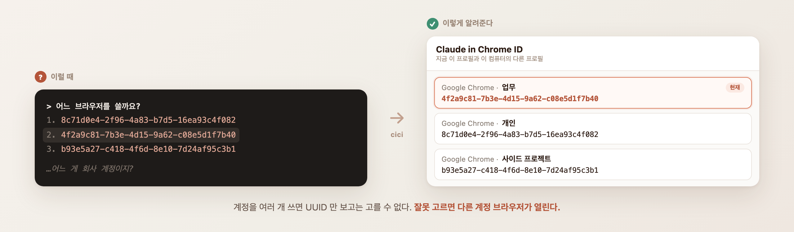
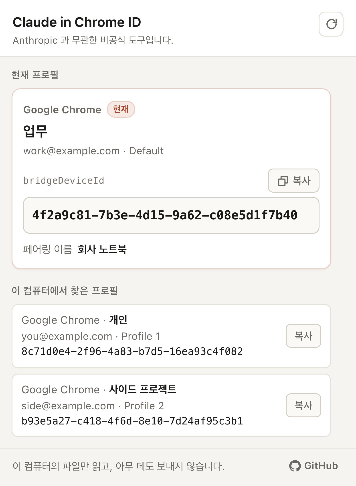

<div align="center">


# cici

**Claude Code 브라우저 선택창의 UUID 가 어느 크롬 프로필인지 알려 주는 확장**

[](https://chromewebstore.google.com/detail/gfffgnkeglhkdnkoindcikdblebcmgea)
[](LICENSE)
[](package.json)
[](test)



<sub>비공식 도구다. Anthropic 이 만들지 않았고 Anthropic 과 아무 관계가 없다.<br>
Claude, Claude Code, Claude in Chrome 은 Anthropic 의 상표다.</sub>

</div>

---

## 무엇을 푸는가

크롬에서 계정을 여러 개 쓰면 — 회사, 개인, 사이드 프로젝트 — Claude Code 는 어느 브라우저를 쓸지
물어보면서 **UUID 말고는 아무 단서도 주지 않는다.**

```
어느 브라우저를 쓸까요?
  1. 8c71d0e4-2f96-4a83-b7d5-16ea93c4f082
  2. 4f2a9c81-7b3e-4d15-9a62-c08e5d1f7b40
  3. b93e5a27-c418-4f6d-8e10-7d24af95c3b1
```

잘못 고르면 **다른 계정으로 로그인된 브라우저가 열린다.** 회사 계정으로 작업하려는데 개인 브라우저가
뜨거나, 그 반대가 된다.

cici 는 그 한 가지 질문에만 답한다. **어느 UUID 가 어느 프로필인가.**

<div align="center">

</div>

### 한 번 알면 매번 안 골라도 된다

```
회사 브라우저(4f2a9c81-7b3e-4d15-9a62-c08e5d1f7b40)로 열어줘
```

`/chrome` → **Select browser…** 로 고정해 두는 것도 된다. 둘 다 UUID 를 알아야 가능하다.

---

## 설치

### 1. [Chrome 웹 스토어에서 설치](https://chromewebstore.google.com/detail/gfffgnkeglhkdnkoindcikdblebcmgea)

### 2. 파일 URL 접근 켜기

이 한 단계가 **반드시** 필요하다. 안 켜면 팝업이 결과 대신 안내 화면을 띄운다.

1. `chrome://extensions` 열기
2. cici 의 **세부정보**
3. **파일 URL에 대한 액세스 허용** 켜기
4. 툴바 아이콘 클릭

> 토글을 켜면 크롬이 확장을 다시 불러와 팝업이 닫힌다. 고장이 아니다.
> 브라우저를 재시작할 필요 없이 **팝업만 다시 열면** 된다.

**왜 이 권한이 필요한가.** `bridgeDeviceId` 는 Claude in Chrome 확장이 자기 `chrome.storage.local`
에 넣어 둔 값이고, 확장은 다른 확장의 저장소를 읽을 수 없다. 그래서 디스크의 파일을 직접 읽는 것
말고는 방법이 없다. 시도해 본 다른 경로들과 각각이 막힌 이유는 [`docs/why.ko.md`](docs/why.ko.md)
에 근거와 함께 정리해 두었다.

### 3. 프로필마다 반복

확장 설치는 프로필 단위다. 다만 팝업은 **이 컴퓨터의 모든 프로필**을 보여 주므로, 한 프로필에만
설치해도 전체 목록은 볼 수 있다. "지금 이 프로필" 표시가 그 프로필 기준일 뿐이다.

---

## 개인정보

* **네트워크 요청 0건.** CSP 가 `connect-src 'self' file:` 로 묶여 있어 원격 연결 자체가 불가능하다.
* **읽기 전용.** LevelDB `LOCK` 을 잡지 않으므로 브라우저가 켜져 있어도 안전하다.
* **수집·전송·저장 없음.** 읽은 값은 화면에 뿌리고 끝난다.
* 확장이 쓰는 것은 **자기 자신의** 난수(`__cici_nonce`) 하나뿐이다. 다른 확장의 저장소에는
  한 바이트도 쓰지 않는다.

전문은 [`docs/privacy-policy.md`](docs/privacy-policy.md).

---

## 문서

| 문서 | 내용 |
| --- | --- |
| [확장 자세히](docs/extension.md) | 팝업 화면, 구분하는 상태 다섯 가지, 요구 권한 |
| [동작 원리와 한계](docs/how-it-works.md) | 값이 어디 있나, 자기 프로필을 어떻게 아나, 못 하는 것 |
| [왜 이 구조인가](docs/why.ko.md) | 시도한 경로와 막힌 이유 — 근거와 검증 방법 ([영어판](docs/why.md)) |
| [CLI](docs/cli.md) | 터미널에서 모든 프로필을 한 번에 보는 부가 도구 |
| [개발](docs/development.md) | 저장소를 받아서 고치기 |
| [배포](docs/release.md) | 새 버전을 스토어에 올리는 절차 |
| [개인정보 처리방침](docs/privacy-policy.md) | 전문 |
| [English](README.en.md) | 영어판 |

---

## 라이선스

MIT — [`LICENSE`](LICENSE)

cici 는 Anthropic 이 만들지 않은 비공식 도구이며, Anthropic 과 제휴 관계가 없고
Anthropic 의 보증이나 후원을 받지 않았다.
Claude, Claude Code, Claude in Chrome 은 Anthropic 의 상표다.
